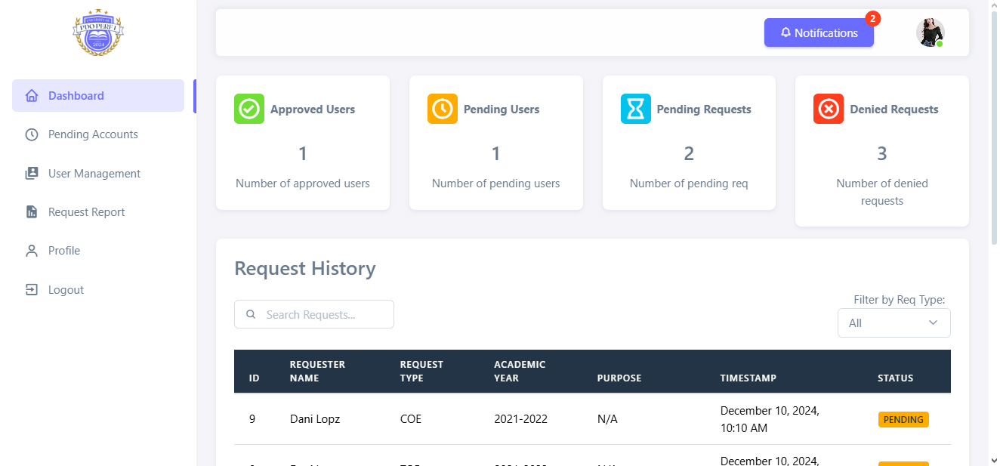
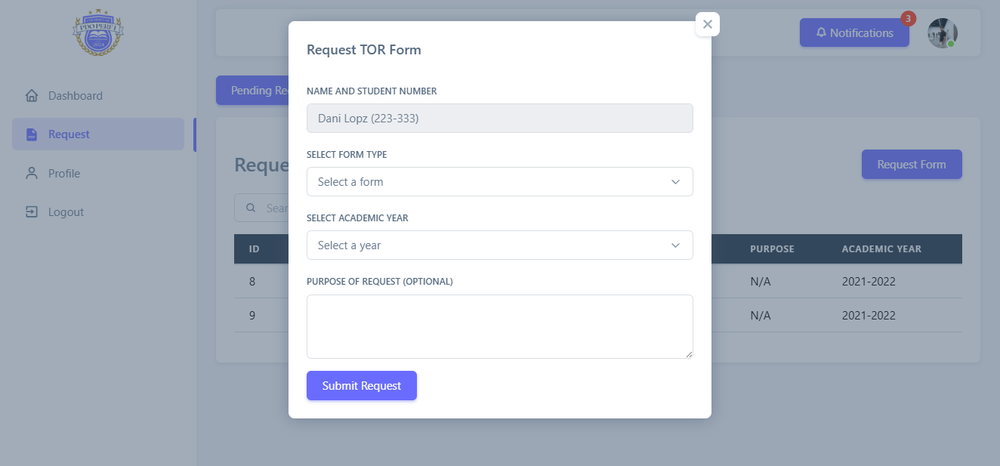

  

# 🏫 School Permit System

The **School Permit System** is a **web-based platform** designed to simplify the handling of **school permit applications, requests, and approvals**.  
It allows schools and administrators to manage permit records efficiently while reducing paperwork through a fully digital workflow.

---

## 🖼️ Preview

| Login Page | Requesting Permit |
|-----------|-----------|
|  |  |

---

## 🚀 Features

- 📝 **Online Permit Application**  
  Submit school permit requests electronically with complete details.

- 🔄 **Permit Status Tracking**  
  Track application progress (Pending, Approved, Rejected) in real time.

- 🧑‍💼 **Admin Approval System**  
  Review, approve, or reject permit requests through an admin dashboard.

- 📂 **Document Management**  
  Upload and store permit-related documents securely.

- 🔐 **User Authentication**  
  Role-based login for applicants and administrators.

- 📊 **Reports & Records**  
  Generate summaries and maintain organized digital records.

- 🗄️ **Database Integration**  
  Centralized MySQL database for reliable data storage.

---

## 🛠️ Tech Stack

| Layer | Technology |
|------|-----------|
| Frontend | HTML, CSS, JavaScript |
| Backend | PHP |
| Database | MySQL |
| Server | Apache (XAMPP / Laragon) |
| Architecture | Web-Based Client–Server |

